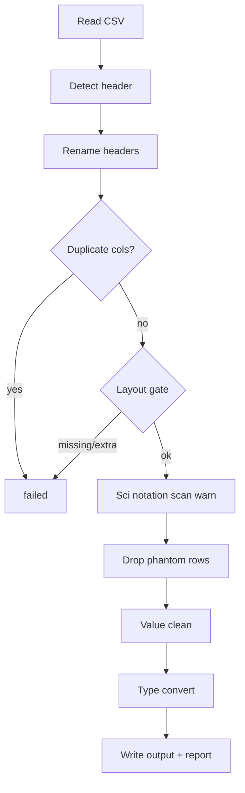

# Clean pipeline guide

For colleagues running or reviewing the main data clean (`python -m src.main`).  
**Policy reference:** [README_DATA_CLEAN_POLICY.md](../README_DATA_CLEAN_POLICY.md) · [中文版](../README_DATA_CLEAN_POLICY_CN.md)  
**Batch workflow (audit first):** [audit_clean_workflow.md](audit_clean_workflow.md)

---

## Quick start

```bash
pip install -r requirements.txt

# Optional: audit first
python -m audit.main --base-dir .

# Batch clean
python -m src.main --base-dir .

# Single file (path under raw/)
python -m src.main --base-dir . --file raw/teamA/foo.csv
```

Outputs:

- `output/` — cleaned CSV (mirrors `raw/` paths)  
- `reports/report_YYYYMMDD_HHMMSS.xlsx` — run report  
- `logs/pipeline.log`

---

## End-to-end flow



**Layout gate:** missing or extra columns vs YAML → **no output**, `failed`. Wrong order only → reorder + `warning`.

---

## What to configure (`file_rules.yaml`)

YAML defines **schema**, not clean behavior:

- `mappings` / `raw_prefix_to_standard` — which standard applies to which raw file  
- `rules.<standard>.columns` — `name`, `type`, `date_format`  
- `defaults` / per-rule `read` — encoding, delimiter, `skiprows`  

See [config/README.md](../config/README.md).

---

## Reading the report

### Start here: `file_summary`

| Column | Use |
|--------|-----|
| `status` | `success` / `warning` / `failed` / `skipped_xlsx` |
| `output_written` | `Y` only when a cleaned CSV was saved |
| `layout_status` | `pass` / `fail` / `n/a` |
| `clean_status` | `pass` / `warning` / `fail` / `n/a` |
| `status_reason` | Short human summary |

### Drill down: `issues_detail`

| `phase` | When |
|---------|------|
| `pre_clean` | Read, layout, scientific notation, total-like rows |
| `clean_action` | Placeholders, `$`, parens, phantom removal |
| `post_clean` | Type/date conversion, scientific preserved in output |

| `category` (examples) | Severity |
|-------------------------|----------|
| `LAYOUT` | `error` on fail |
| `STRUCTURE` | `error` (duplicate cols) or `warning` (ragged CSV) |
| `FILE` | `warning` (encoding fallback) |
| `SCIENTIFIC` | `warning` / `info` |
| `DATE` | `warning` (parsed outside strict YAML format) |
| `TYPE` | `warning` (conversion failed) |
| `TOTAL` | `warning` (row kept) |
| `PHANTOM` | `info` (rows removed) |

### Column detail: `column_stats`

Per file and column: null counts, type conversion failures, scientific notation cells, date parse method counts (`date_strict_parsed`, `date_alternate_parsed`, `date_excel_serial_parsed`, `date_inferred_parsed`).

### Per-column cleaning: `clean_actions_by_column`

Counts of `-` / `$` / accounting parens / comma stripping by column.

---

## Common scenarios

| You see | Likely cause | Action |
|---------|--------------|--------|
| `failed`, missing column | Raw header lacks a YAML column | Fix source or update standard/YAML |
| `failed`, extra column | Raw has columns not in standard | Remove column from export or extend standard |
| `warning`, column reorder | Headers present but wrong order | Usually safe; output reordered to YAML |
| `warning`, DATE | Dates like `1/15/2025` or Excel serial | Output still normalized to YAML `date_format`; verify sample rows |
| `warning`, SCIENTIFIC on Amount | Excel exported large number | Float literal kept in output; verify value |
| `warning`, total-like rows | “Grand Total” in data | Row kept; confirm not double-counting |
| `skipped_xlsx` | Excel input | Save as CSV |

---

## Audit vs clean

| | Audit (`audit.main`) | Clean (`src.main`) |
|--|----------------------|---------------------|
| Purpose | Find problems before clean | Produce cleaned CSV + report |
| Missing/extra columns | Reported | **Fail**, no output |
| Placeholders `-`/null | Often **error** | Cleared to empty |
| Accounting `()` | **Error** on numeric | Cleaned to negative |
| Scientific notation | Warning/error | Warning; float literal preserved in output |

Run audit first on new batches; use clean for production output. See [audit_clean_workflow.md](audit_clean_workflow.md).

---

## Regression fixtures

```bash
python tools/generate_pipeline_fixtures.py
python -m pytest tests/test_clean_pipeline_fixtures.py -q
```

Fixtures live under `raw/pipeline_tests/` (not skipped; unlike `raw/_audit_fixtures/`).

---

## Module map

| Module | Role |
|--------|------|
| `src/main.py` | Orchestration |
| `src/io.py` | CSV read, encoding, ragged rows |
| `src/structure.py` | Layout gate, duplicate columns |
| `src/cleaner.py` | Cell value clean |
| `src/validator.py` | Dates, numeric, status |
| `src/row_filters.py` | Phantom / total scan |
| `src/reporting.py` | Issue rows for Excel |
| `src/exporter.py` | CSV + report write |

See also [docs/main.md](main.md), [docs/validator.md](validator.md), [docs/cleaner.md](cleaner.md).
